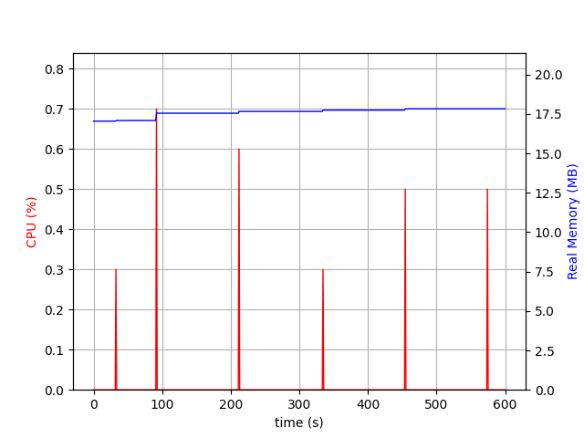
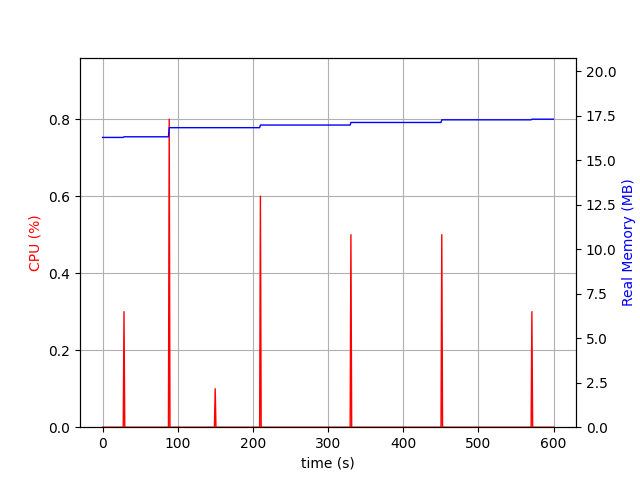
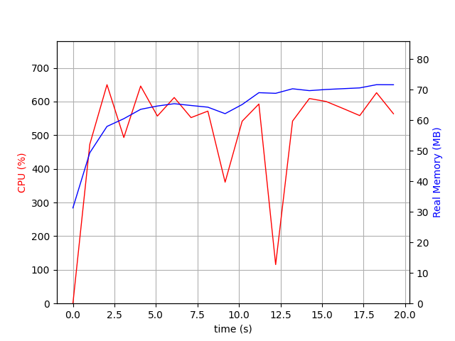
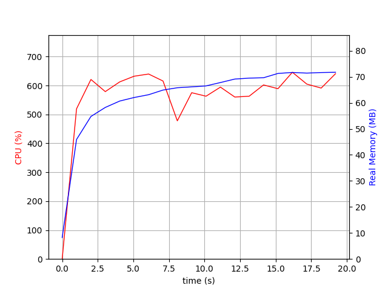
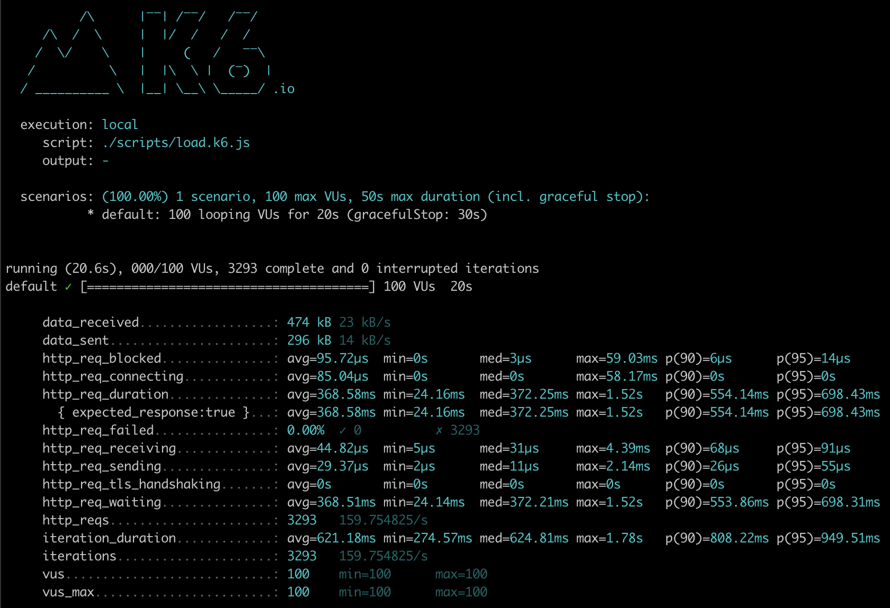
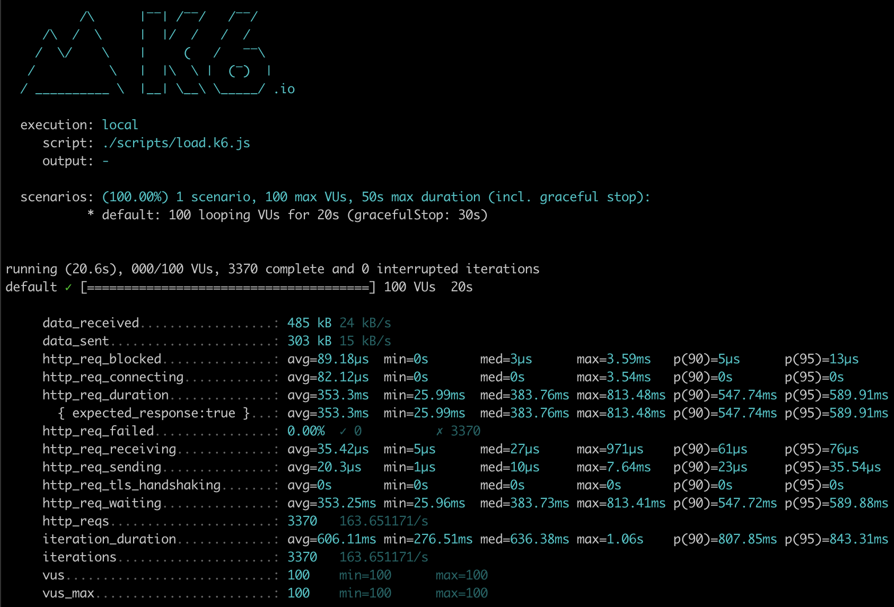

# Sample Web App

> Testing Uber's fx dependency injection system for Go

## Libraries
- HTTP Web Framework [Gin](https://github.com/gin-gonic/gin)
- DB + ORM [GORM](https://github.com/go-gorm/gorm)
- DI Framework [fx](https://github.com/uber-go/fx)
- Logging [zap](https://github.com/uber-go/zap)

## Benefits
1. **Modularity and Reusability**: Fx allows you to break your application into small, independent parts that can be put together like building blocks. This makes it easy to reuse parts of the application in other projects, and to test each part separately.
2. **Explicit Dependencies**: Fx forces you to clearly define what each part of the application needs to work, making it easy to understand how everything fits together and to identify potential problems.
3. **Type Safety**: Fx uses Go's type system to make sure that each part of the application gets the right inputs, which helps prevent errors from happening at runtime.
4. **Lifecycle Management**: Fx allows you to specify what should happen when the application starts and stops, such as starting and stopping services, opening and closing connections and other tasks.
5. **Easy to Test**: Fx makes it easy to test the application by allowing you to replace parts with mock versions for testing purposes.
6. **Easy to Monitor**: Fx provides a way to monitor the status of the application and its parts, which makes it easy to identify and fix problems.
7. **Easy to extend**: Fx allows you to easily add new functionality to the framework by adding custom hooks to the application's lifecycle and by adding custom options.

## Run

```shell
make run
```

## Benchmarks

- Binary size  

> make build

| FX | No FX |
| -- | -- |
| 15M | 14M |

- Idle

> ./scripts/psrecord.sh <PID> nofx 20 load

| FX | No FX |
| -- | -- |
|  |  |

- HTTP Requests

> PORT=15000 make run
> psrecord <PID> --include-children --interval 1 --duration 20 --plot benchmarks/fx-cpu-memory-plot-20.load.png & k6 run --vus 100 --duration 20s -e PORT=15000 ./scripts/load.k6.js
> PORT=15001 make run-nofx
> psrecord <PID> --include-children --interval 1 --duration 20 --plot benchmarks/nofx-cpu-memory-plot-20.load.png & k6 run --vus 100 --duration 20s -e PORT=15001 ./scripts/load.k6.js

| FX | No FX |
| -- | -- |
|  |  |
|  |  |

## CHANGELOG
### 2023-01-21
- Added database & orm with GORM
- Added a non-fx version of the web app for benchmarking
- Added some basic cpu/memory benchmarks
- Added some basic load tests with k6
